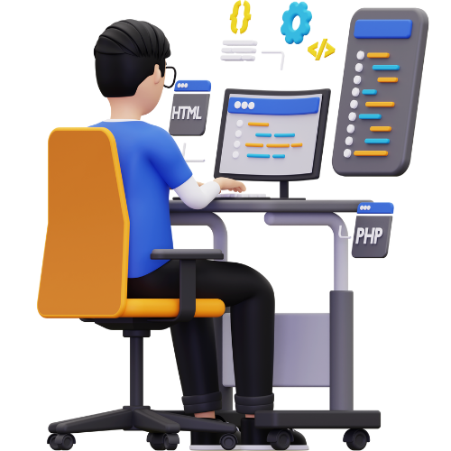

<h1 align="center">Hi 👋, I'm Lakith Randula</h1>
<h3 align="center">Computer Science Student from Sri lanka</h3>

I am captivated by computer technology 🌐 since childhood, I'm driven to pursue software engineering. Exploring new tech stacks 💻 to create innovative projects 🛠️ brings immense joy, pushing boundaries endlessly in this ever- evolving field.

  
  
  
  
  
 

  
  
  
  
  

   

- 🌱 I’m currently learning **Machine Learning, Data Science and AI **

- 💬 Ask me about **C, C#, Python, PHP, Java and NodeJS**

- 📫 How to reach me **lakithrandula6@gmail.com**

- 📄 Know about my experiences [my experiences](#)

- ⚡ Fun fact **I think I'm funny**

 
<h3 align="left">Connect with me:</h3>

 

<h3 align="left">Tech Stack:</h3>

- Language

  

- Frontend

  

- Backend

  

- Database

  

- Tools

  

<h3 align="left">Certifications:</h3>

    
    
    

  

## 🏆GitHub Trophies

# 📊 GitHub Stats :

  
  

  

<!--div style="display: flex; text-align: center;">

</div-->
<!--p align="center"></p-->

<h3 align="left">Activity Graph:</h3>
 

&nbsp;

