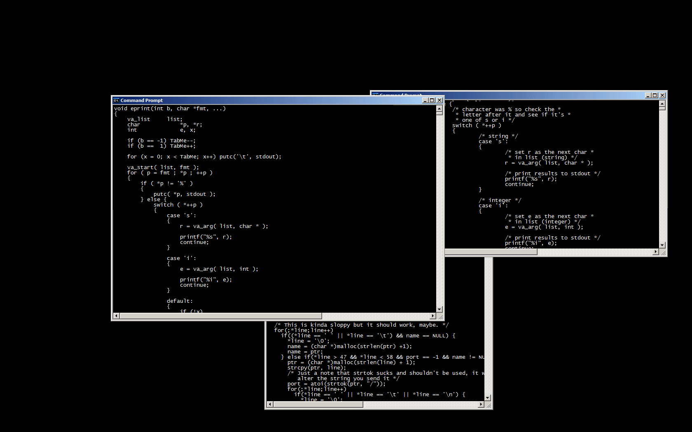
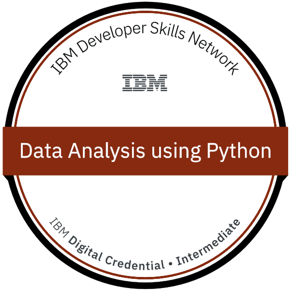
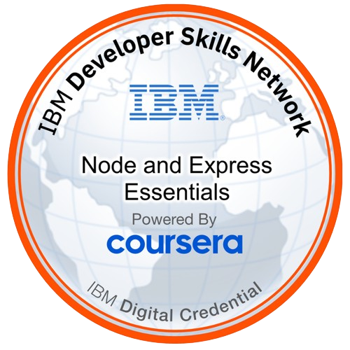

<h1 align="center">Hi 👋, I'm Lakith Randula</h1>
<h3 align="center">Computer Science Student from Sri lanka</h3>

I am captivated by computer technology 🌐 since childhood, I'm driven to pursue software engineering. Exploring new tech stacks 💻 to create innovative projects 🛠️ brings immense joy, pushing boundaries endlessly in this ever- evolving field.

  
  
  
  
  
 

  
  
  
  

   

- 🔭 I’m currently working on **###**

- 🌱 I’m currently learning **Machine Learning, Data Science and AI **

- 💬 Ask me about **C, C#, Python, PHP, Java and NodeJS**

- 📫 How to reach me **lakithrandula6@gmail.com**

- 📄 Know about my experiences [my experiences](http://supun.traditionalme.life/#resume)

- ⚡ Fun fact **I think I'm funny**

 
<h3 align="left">Connect with me:</h3>

 

&nbsp;

<!--p align="center"></p-->

<h3 align="left">Languages and Tools:</h3>

- Frontend

  

- Backend

  

- Database

  

- Tools

  

 

<h3 align="left">Certifications:</h3>

    
    
    

  

👦 ABOUT ME

I'm Lakith Randula. I'm an undergraduate student in University of Kelaniya, Sri Lanka. I always try to compete with the world, which makes me a better person than I am yesterday.

